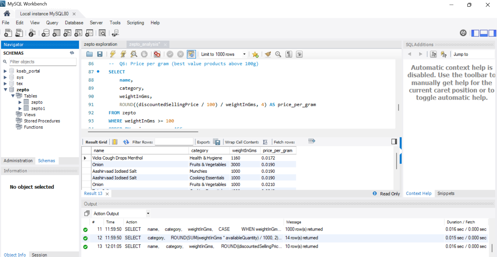
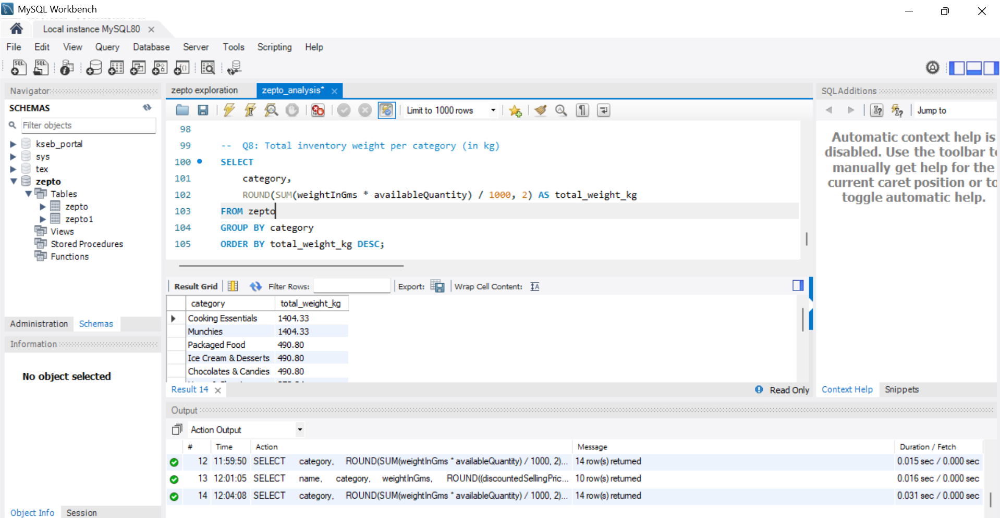

# 🛒 Zepto SQL Data Analysis

A end-to-end SQL project analyzing product, pricing, and inventory data from **Zepto** — India's quick-commerce grocery platform. The goal was to extract actionable business insights around discounts, stock availability, revenue estimation, and inventory distribution.

---

## 📌 Project Overview

Zepto operates a high-SKU, fast-moving product catalog. This project digs into that catalog to answer real business questions:

- Which products offer the best value for money?
- Which high-value products are currently out of stock?
- Which categories drive the most estimated revenue?
- How is inventory weight distributed across categories?

---

## 🗂️ Repository Structure
```
zepto-sql-analysis/
│
├── zepto_exploration.sql   # Data cleaning, validation & debugging queries
├── zepto_analysis.sql      # Final business analysis queries (8 questions)
├── screenshots/            # MySQL Workbench query result screenshots
└── README.md
```

---

## 🔧 Tools Used

- **MySQL 8.0** — Query execution
- **MySQL Workbench** — IDE and result visualization
- **SQL Concepts** — Aggregations, CASE statements, GROUP BY, ORDER BY, filtering, derived columns

---

## 🧹 Data Cleaning Highlights

Before analysis, the raw dataset required a few fixes documented in `zepto_exploration.sql`:

- **BOM character fix** — renamed `Category` → `category` due to UTF-8 encoding issue
- **Data type awareness** — `outOfStock` stored as STRING (`'TRUE'`/`'FALSE'`), not BOOLEAN
- **Price conversion** — all price columns (`mrp`, `discountedSellingPrice`) stored in **paise**, divided by 100 for rupee values
- **Duplicate SKU check** — multiple entries per product name identified and noted

---

## 📊 Analysis Questions & Key Findings

### Q1 — Top 10 Best-Value Products (Highest Discount %)
Identified products with the steepest discounts to surface deals with the highest markdown from MRP.

### Q2 — High MRP Products That Are Out of Stock
Filtered expensive products (MRP > ₹300) with `outOfStock = TRUE` — highlighting potential lost revenue opportunities.

### Q3 — Estimated Revenue by Category
Calculated `discountedSellingPrice × quantity` per category.
> 💡 **Finding:** Categories like Cooking Essentials and Munchies dominate estimated revenue.

### Q4 — Premium Products with Low Discounts
Products priced above ₹500 with less than 10% discount — useful for identifying pricing strategy gaps.

### Q5 — Top 5 Categories by Average Discount
Ranked categories by average discount percentage to understand promotional intensity.

### Q6 — Price per Gram Analysis
Calculated `selling_price / weight_in_grams` for products ≥ 100g.
> 💡 **Finding:** Vicks Cough Drops Menthol offers the best value at ₹0.0172/gram, followed by Onion and Aashirvaad Iodised Salt.

### Q7 — Product Weight Segmentation
Classified all products into weight buckets using CASE:
- **Low** → < 1 kg
- **Medium** → 1–5 kg
- **Bulk** → > 5 kg

### Q8 — Total Inventory Weight per Category (kg)
Aggregated `weightInGms × availableQuantity` per category.
> 💡 **Finding:** Cooking Essentials and Munchies carry the heaviest inventory at **1,404 kg each** — nearly 3x other categories.

---

## 📸 Screenshots

**Q6 — Price per Gram Results**



**Q8 — Total Inventory Weight by Category**



---

## 💡 Key Takeaways

- SQL is a powerful tool for extracting real business insights from raw product data — even without Python or dashboards
- Data cleaning is unavoidable: encoding issues, string-stored booleans, and paise-vs-rupee conversions were all real obstacles
- Inventory concentration in 2–3 categories suggests Zepto's catalog strategy leans heavily on everyday staples

---

## 📁 Dataset

Dataset sourced from [Kaggle](https://www.kaggle.com/) — Zepto product listings including MRP, selling price, discount %, weight, stock status, and quantity.

---

## 👤 Author

**Fethmi Bilu**
Aspiring Data Analyst | SQL • Python • Excel
[LinkedIn](https://www.linkedin.com/in/fethmi-bilu) | [GitHub](https://github.com/Fethmibilu)
